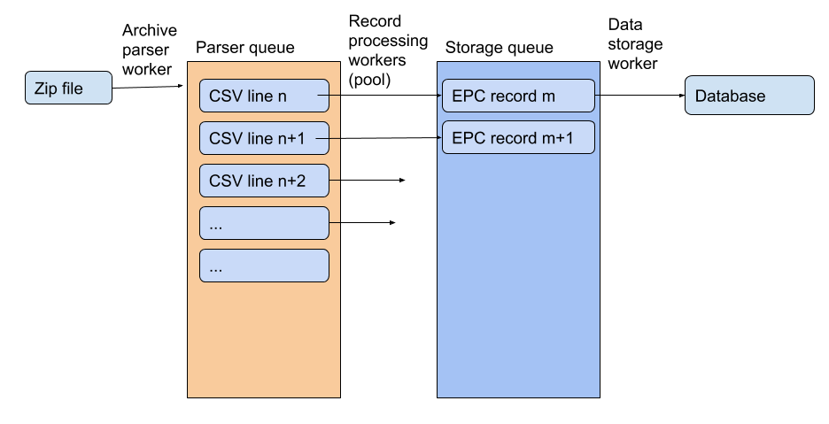

# EPC Data Importer

This repo implements a PoC importer according to [this challenge](https://github.com/landtechnologies/technical-challenge/blob/master/epc-data-import.md).


## PoC usage

Running the code requires:

* `docker-compose`
* Downloaded EPC data (the archive usually called `all-domestic-certificates.zip`) places in the `./import` folder
* modify `docker-compose.yml` if you need to (the default one imports a limited set of items). See that file with the relevant environment variables, and their settings

To run the importer:

```
docker-compose up
```
This will build fire up 3 containers:

* A PostgreSQL database
* An Adminer database viwer (accessible over [http://localhost:8080](http://localhost:8080) when running, with the credentials and info from the `docker-compose.yml`. Don't forget to change the database type to PostgreSQL)
* A worker that does the import step

The worker container will stop running when the import task is finished:

```
processor_1  | INFO:root:Input queue: 3835 | database queue: 151
processor_1  | INFO:root:Input queue: 1891 | database queue: 12
processor_1  | INFO:root:Input queue: 0 | database queue: 11
processor_1  | INFO:root:Input queue: 0 | database queue: 0
processor_1  | INFO:root:Processed 50000 records
processor_1  | Imports succeeded
processor_1  | Can check results by logging in to the database management at http://localhost:8080 with 'postgres' / 'somethingrandom'
```

The database is stored in the `./data` folder created by the relevant container, and can be removed to clean things up (will need a `sudo rm -rf ./data` most likely).


## Processor Architecture

The processor architecture here as follows:



* The zip archive is processed first, the right filenames are found for the relevant CSV files
* Those files are loaded and each line is added to a processing queue
* The processing queue is fed to a pool of workers (large number), which take each record, parse into records, do any relevant API lookup, etc, and the processed items are added to a database storage queue
* The database storage queue is handled by a single worker talking to the database container, and storing each record.

This setup allows parallelizing some of the slow functions (such as waiting for the API replies in the record processing step), while a given database connection without much complexity.

## Project comments

* What tools/resources you would use?

Here the tooling is mostly Python for the processing for more flexible splitting of jobs. Docker enables easier deployment.

* How you would scale the import?

Instead of a single Docker container handling all the processing, spreading out load over multiple pods, e.g. in a K8s cluster. Each CSV file can be its own task, and worker pods picking them up. The database storage can also be multi-worker.

If adding performance monitoring (eg. through Prometheus, monitoring how long different steps take), can see better where the bottlenecks are and try to parallelize / scale those sections (whether it's the initial parsing, the processing, database storage step).

* How often would you run the import?

The import should be possible to run on a weekly basis (likely with performance tuning).

This also touches on how the data is gathered: currently the [https://epc.opendatacommunities.org/](https://epc.opendatacommunities.org/) website is relatively rough to import from. The download links are S3 signed URLs which expire, and the login is based on receiving an email with a specific code. This "trigger login" -> "automatically receive email and extract login link" -> "grab S3 signed URL" -> download can be automated but might need more infrastricture, and feels relatively fragile (mostly due to the email.)

As a further note on the import, currently the pattern of getting the data to the processing container is via a docker volume. That would work also if the downloads would be automatic as above. A shared volume could be the place where a "download service" would place the task, and the processing service could notice the files (any additional metadata) and start the import.

And alternative is using [Domestic Energy Performance Certificates API](https://epc.opendatacommunities.org/docs/api/domestic), which would allow likely more frequent improts. There the first hurdle is that max query size is limited, so any scraping needs to be done with searches that can iterate over the entire data. A possible way forward with that is searching by "lodgement day", and iterate. There are likely corner cases, but from the given variables, this feels the most iterable.

If the processing service would be to scrape the API instead of the zip download, then the processing tool can have a small API endpoint to trigger a task by a request, or the processing can be rerun as a K8s cronjob.

* How would you know when the import has failed?

From the container logs. Exit codes. Also can attach alerting/notification (e.g. through Prometheus alerting)

* Testing

Some very minimal test is included in this PoC, currently testing just the CSV line parser. To run the tests do:

```shell
cd processing
pytest app/processor_test.py
```

## License

Copyright (c) 2019 Gergely Imreh <gergely@imreh.net>

Permission is hereby granted, free of charge, to any person obtaining a copy
of this software and associated documentation files (the "Software"), to deal
in the Software without restriction, including without limitation the rights
to use, copy, modify, merge, publish, distribute, sublicense, and/or sell
copies of the Software, and to permit persons to whom the Software is
furnished to do so, subject to the following conditions:

The above copyright notice and this permission notice shall be included in all
copies or substantial portions of the Software.

THE SOFTWARE IS PROVIDED "AS IS", WITHOUT WARRANTY OF ANY KIND, EXPRESS OR
IMPLIED, INCLUDING BUT NOT LIMITED TO THE WARRANTIES OF MERCHANTABILITY,
FITNESS FOR A PARTICULAR PURPOSE AND NONINFRINGEMENT. IN NO EVENT SHALL THE
AUTHORS OR COPYRIGHT HOLDERS BE LIABLE FOR ANY CLAIM, DAMAGES OR OTHER
LIABILITY, WHETHER IN AN ACTION OF CONTRACT, TORT OR OTHERWISE, ARISING FROM,
OUT OF OR IN CONNECTION WITH THE SOFTWARE OR THE USE OR OTHER DEALINGS IN THE
SOFTWARE.